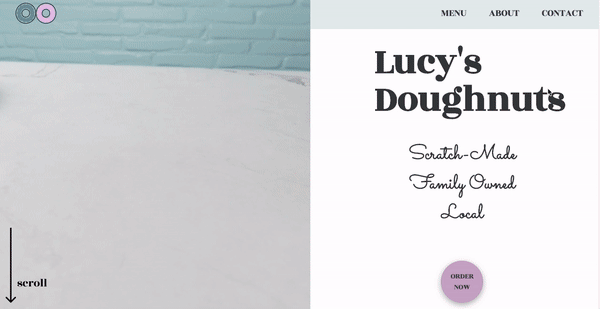

<h1>Lucy's Doughnuts</h1>
<h2>A Mockup Site for a Doughnut Shop</h2>

The main purpose of this site was to experiment with scroll animations that progress an image sequence. This site also served as CSS grid practice. The donut animation was created in Blender following this <a href="https://www.youtube.com/playlist?list=PLjEaoINr3zgEq0u2MzVgAaHEBt--xLB6U">youtube tutorial.</a> The scroll effects were achieved using <a href="https://scrollmagic.io/">ScrollMagic</a> and <a href="https://greensock.com/gsap/">GSAP.</a> Site was protoyped in Figma (https://www.figma.com/file/Q6OlZnQvk4niNYbr1ZBdlv/Lucy-s-Doughnuts?node-id=0%3A1).

<h3>WORKS BEST ON CHROME</h3>

Mobile loading is very slow. ScrollMagic setPin() seems to have a bug in Safari.

<h3>Desktop:</h3>

<h3>Mobile:</h3>

